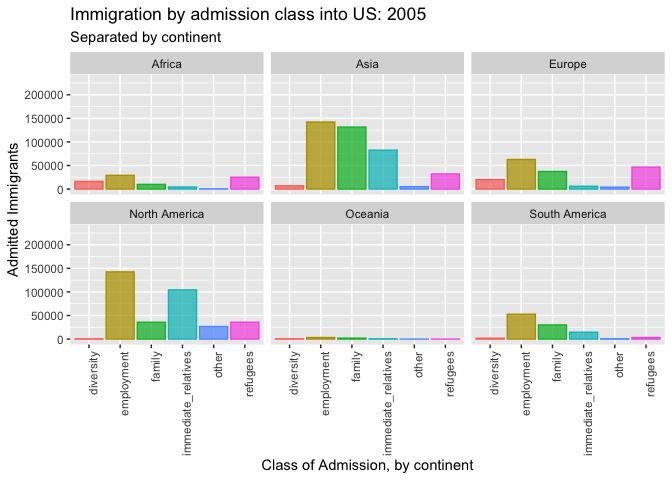

**#About This Project**

Every year, there are roughly ~1M immigrants coming to the US from various origins and through different admission channels. How are these immigrants fitting in once they are in the US? Is there a certain a certain group that needs particular help in fitting into the American society?

One important metrics for fitting into the American society, is English speaking capability. According to the US census bureau, in 2017, while 91% of all US citizens self-identified as speaking English "very well", the number among all foreigh-born citizens was only 52%.

Would this impairment in English-speaking capability among immigrants differ by origin, channel of admission, or time? This visualization project aims to provide users with a tool to explore this issue, during the time span of 2009 - 2017.

*time span determined by data availability


**#Raw Data Source**

My raw data comes from two sources: 

1. Homeland Security: 
https://www.dhs.gov/immigration-statistics/yearbook

    covering annual immigration count by different characteristics (visa type, country of origin etc.)

2. American Fact Finder(US Census Bureau): https://factfinder.census.gov/faces/nav/jsf/pages/searchresults.xhtml?refresh=t#none

    covering US resident census data(immigration status, english speaking capability, in labor force or not, etc.)
    
Both data sets address the issue of immigrants to US, segmented by country and state of origin. Note that the US Census Bureau data covers all immigrants *living* in US in that particular year, while the Homeland Security data covers immigrants *moving* to US in that year. Therefore, there is strong connection between the two datasets, yet the Homeland Security sample population is only part of the US Census Bureau sample population.

**#Data Storage and Cleaning: for TF only, will not be shown to users**

Homeland Security data are stored under: raw_data > immigration_yearbook

US Census Bureau data are stored under: raw_data > english_speaking_immigrants

Relevant data that may or may not be used later is under: raw_data > parkinglot_4data


```{r setup, include=FALSE}
knitr::opts_chunk$set(echo = TRUE)

#When installing package data.table, choose "No compliation" method

library(readxl)
library(ggplot2)
library(readxl)
library(janitor)
library(gifski)
library(gganimate)
library(data.table)
library(png)
library(tidyverse)

#load the immigration by continent data
#clean up names and values

immigration_continent <- read_xlsx("raw_data/immigration_yearbook/Immigration_ByContinent.xlsx") %>%
  clean_names()

```


data visualization from milestone4 as an illustration

<!--render the gif image-->



